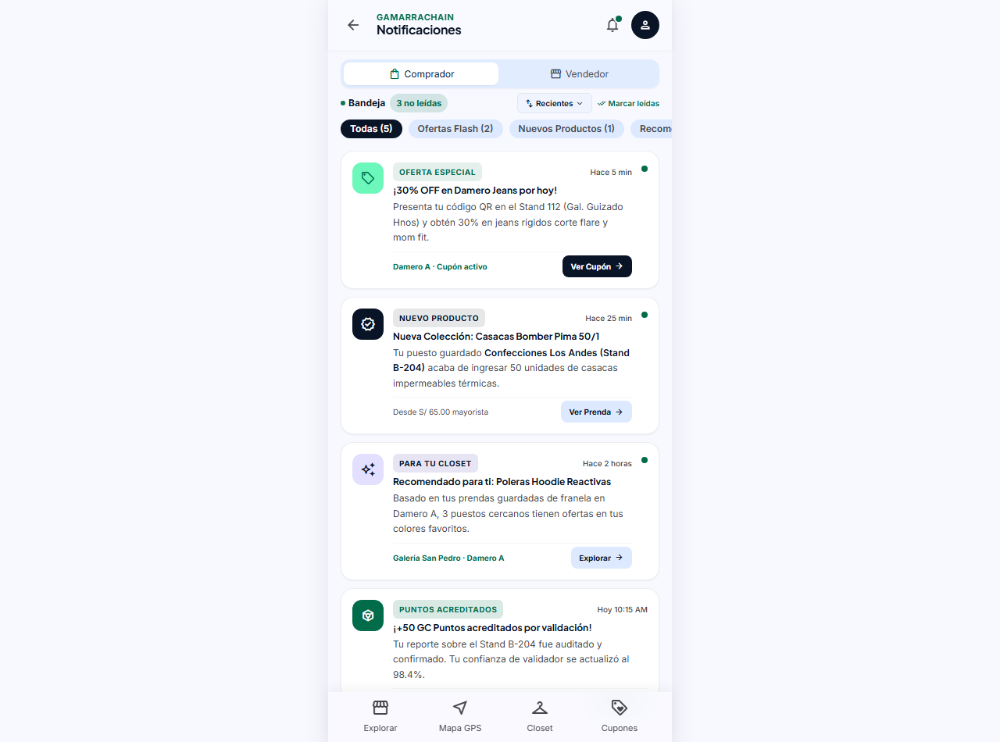
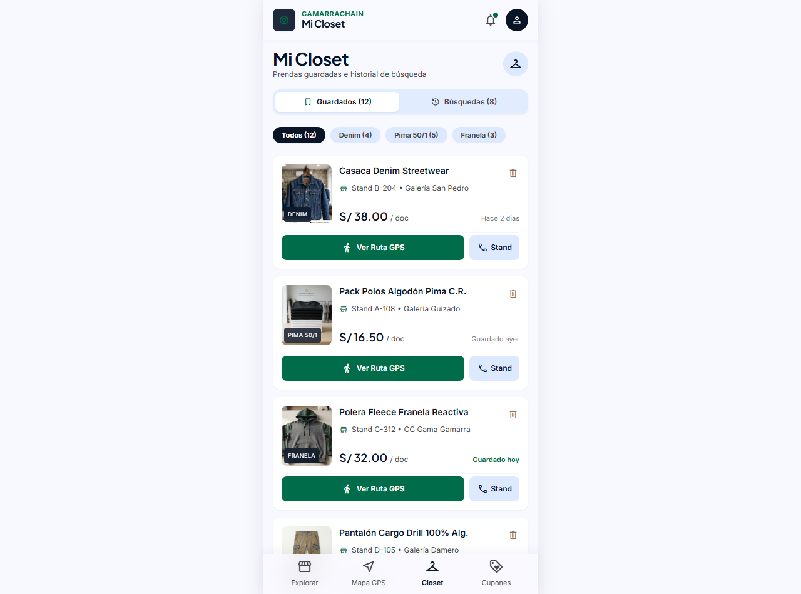
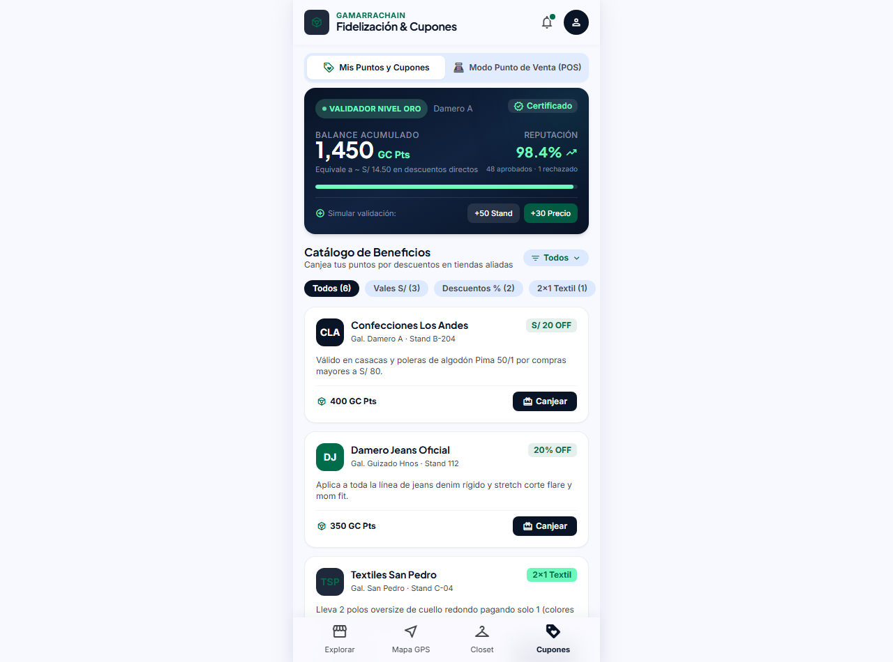
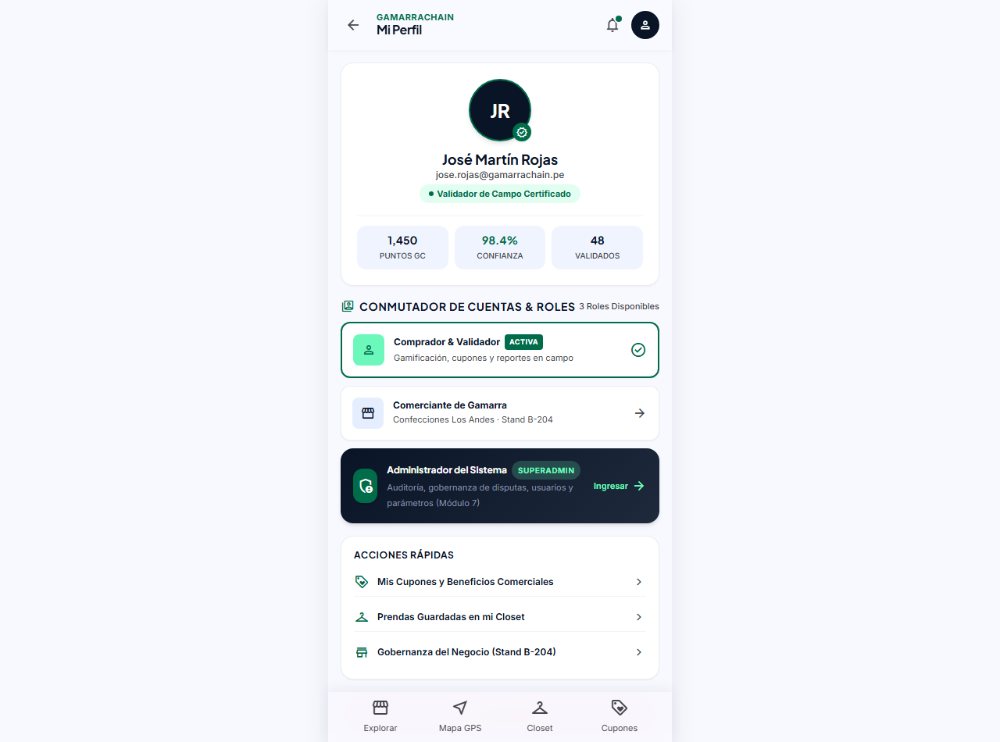
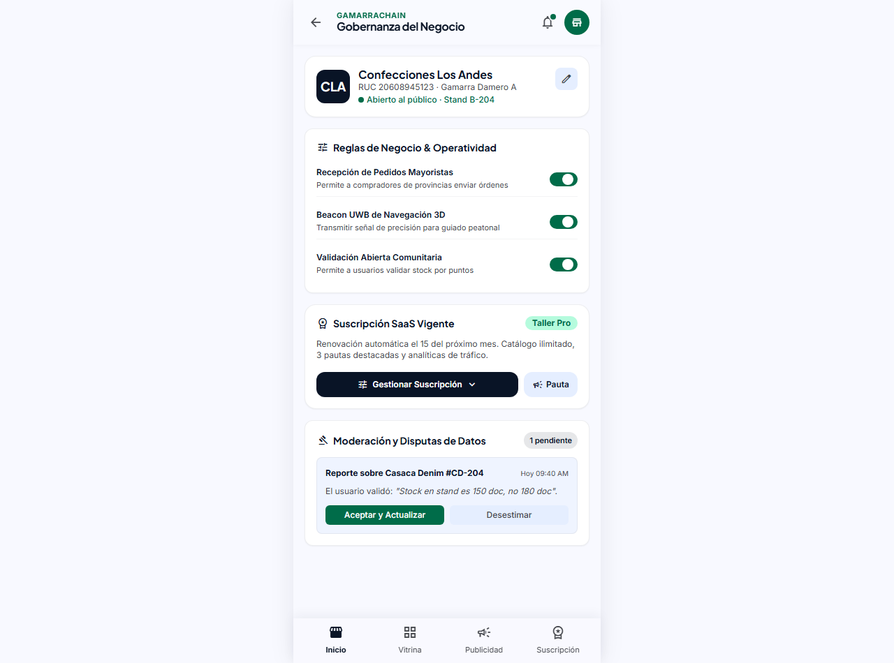
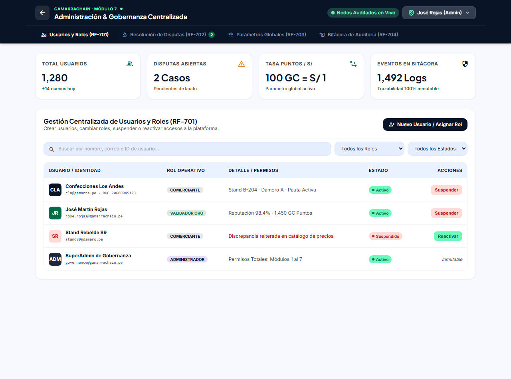

# Documentación Técnica de Prototipos: Módulo 3 y Módulo 7 (José Rojas)

Este documento detalla exhaustivamente las pantallas, vistas y flujos implementados dentro del paquete `prototipos/2_jose_rojas/`, el cual abarca la arquitectura de interfaz para:
1. **Módulo 3:** Incentivos, Fidelización y Experiencia del Comprador / Validador.
2. **Módulo 7:** Gobernanza, Reglas de Negocio y Administración Centralizada del Sistema.

---

## Índice de Pantallas y Vistas

1. [Módulo 3 - Centro de Notificaciones](#1-centro-de-notificaciones)
2. [Módulo 3 - Mi Closet, Guardados e Historial](#2-mi-closet-prendas-guardadas-e-historial)
3. [Módulo 3 - Fidelización, Puntos y Cupones (con simulador POS)](#3-fidelización-puntos-y-cupones)
4. [Módulo 3 - Mi Perfil y Conmutador de Roles](#4-mi-perfil-y-conmutador-de-roles)
5. [Módulo 7 - Gobernanza del Negocio (Stand B-204)](#5-gobernanza-del-negocio)
6. [Módulo 7 - Panel de Administración & Consola Maestra](#6-panel-de-administrador-del-sistema)

---

## 1. Centro de Notificaciones

* **Archivo fuente:** [`prototipos/2_jose_rojas/modulo_3_incentivos_fidelizacion/centro_notificaciones/index.html`](file:///c:/Users/jose/Desktop/Proyectos/Cursos/DiseñoSoftware/Momentaneo-Diseño/prototipos/2_jose_rojas/modulo_3_incentivos_fidelizacion/centro_notificaciones/index.html)
* **Objetivo principal:** Proveer una central unificada y reactiva de alertas, promociones de proximidad por geofencing/UWB y acreditaciones de recompensas en campo.

### Funcionalidades Clave
* **Conmutador de Perfil Dual:** Permite alternar instantáneamente entre la vista de **Comprador** (ofertas flash, nuevos ingresos en stands seguidos, recomendaciones automáticas para el Closet, acreditación de puntos GC) y **Vendedor** (alertas de radar de compradores en camino al stand, reseñas en vivo, consultas de stock y métricas de pauta).
* **Barra de Estado Compacta & Dropdown de Orden:** Barra horizontal de una sola línea con indicador de estado en vivo, contador de mensajes no leídos, selector desplegable de orden (*Recientes*, *No leídas*, *Descuentos*) y botón de acción masiva (*Marcar leídas*).
* **Filtros por Categoría (Chips):** Clasificación en vivo (*Ofertas Flash*, *Nuevos Productos*, *Para Tu Closet*, *Puntos Acreditados*).
* **Acciones Directas en Tarjeta:** Cada tarjeta permite navegar directamente al cupón, a la ficha técnica de la prenda o responder la consulta del comprador.

### Captura de Pantalla


---

## 2. Mi Closet, Prendas Guardadas e Historial

* **Archivo fuente:** [`prototipos/2_jose_rojas/modulo_3_incentivos_fidelizacion/closet_guardados_historial/index.html`](file:///c:/Users/jose/Desktop/Proyectos/Cursos/DiseñoSoftware/Momentaneo-Diseño/prototipos/2_jose_rojas/modulo_3_incentivos_fidelizacion/closet_guardados_historial/index.html)
* **Objetivo principal:** Servir como vestidor digital personal del comprador, permitiendo guardar colecciones y rastrear el historial de navegación para optimizar las rutas de compra física en Gamarra.

### Funcionalidades Clave
* **Control Segmentado (Guardados vs Búsquedas):** Alternancia entre las prendas marcadas como favoritas (12 prendas activas) y el registro cronológico de consultas realizadas.
* **Filtro Rápido Textil:** Clasificación por composición de material (*Denim rígido/stretch*, *Algodón Pima 50/1*, *Franela reactiva*).
* **Ficha de Producto Enriquecida:**
  * Nombre de la prenda, especificación del corte y código de stock.
  * Identificación física del comerciante: nombre de la tienda, galería y stand exacto (ej. *Damero A · Galería Guizado Hnos Stand 112*).
  * Precio minorista y escala por mayor.
  * Disparadores para iniciar ruta de navegación peatonal hacia el stand o eliminar del closet.
* **Historial Inteligente:** Muestra términos populares y prendas visitadas con fecha y opción de reactivar la búsqueda.

### Captura de Pantalla


---

## 3. Fidelización, Puntos y Cupones

* **Archivo fuente:** [`prototipos/2_jose_rojas/modulo_3_incentivos_fidelizacion/fidelizacion_cupones/index.html`](file:///c:/Users/jose/Desktop/Proyectos/Cursos/DiseñoSoftware/Momentaneo-Diseño/prototipos/2_jose_rojas/modulo_3_incentivos_fidelizacion/fidelizacion_cupones/index.html)
* **Objetivo principal:** Implementar el motor de gamificación comunitaria de GamarraChain (RF-301 a RF-304), incentivando la validación física de precios/stock y facilitando el canje de beneficios en tiendas aliadas.

### Funcionalidades Clave
* **Billetera de Puntos & Nivel de Validador:** Visualización del saldo en tiempo real (1,450 GC Puntos), porcentaje de reputación (98.4%) e insignia de *Validador Nivel Oro*.
* **Catálogo de Beneficios Dinámico:**
  * Selector desplegable de filtro por zona o galería (*Todas las galerías*, *Damero A*, *Damero B*).
  * Filtros por tipo de descuento (*Vales S/*, *Porcentaje %*, *Promociones 2x1*).
* **Modal de Canje Criptográfico:** Al presionar "Canjear cupón", genera un código alfanumérico único (`GC-DAM-8942`) con botón para copiarlo o mostrar el código de barra para escanear en caja.
* **Simulador de POS Comerciante (RF-304):** Pestaña integrada que emula el terminal de punto de venta del comerciante para validar la vigencia de cupones, comprobar la firma y consumirlos de forma irreversible.

### Captura de Pantalla


---

## 4. Mi Perfil y Conmutador de Roles

* **Archivo fuente:** [`prototipos/2_jose_rojas/modulo_3_incentivos_fidelizacion/perfil_usuario/index.html`](file:///c:/Users/jose/Desktop/Proyectos/Cursos/DiseñoSoftware/Momentaneo-Diseño/prototipos/2_jose_rojas/modulo_3_incentivos_fidelizacion/perfil_usuario/index.html)
* **Objetivo principal:** Gestionar la identidad digital del usuario, sus estadísticas de reputación como validador y permitir el cambio de contexto entre los 3 roles del ecosistema.

### Funcionalidades Clave
* **Tarjeta de Identidad & Métricas:** Avatar con insignia de verificación oficial, indicador de rol activo, conteo de puntos acumulados, porcentaje de confianza y número de reportes de campo validados (48 validados).
* **Conmutador Rápido de Cuentas y Entornos:**
  1. *Comprador & Validador:* Vista de catálogo, cupones y navegación GPS.
  2. *Comerciante de Gamarra:* Vista orientada al control de stand (Stand B-204 · Confecciones Los Andes).
  3. *Administrador del Sistema (SuperAdmin):* Tarjeta destacada con acceso directo a la consola de gobernanza y auditoría (Módulo 7).
* **Accesos Rápidos a Módulos:** Enlaces directos a Cupones, Closet y Gobernanza del Negocio.
* **Cierre de Sesión Seguro:** Modal interactivo de confirmación antes de desautenticar la cuenta.

### Captura de Pantalla


---

## 5. Gobernanza del Negocio

* **Archivo fuente:** [`prototipos/2_jose_rojas/modulo_7_gobernanza_admin/gobernanza_gestion_negocio/index.html`](file:///c:/Users/jose/Desktop/Proyectos/Cursos/DiseñoSoftware/Momentaneo-Diseño/prototipos/2_jose_rojas/modulo_7_gobernanza_admin/gobernanza_gestion_negocio/index.html)
* **Objetivo principal:** Proveer al comerciante o dueño de taller textil el control de operatividad de su puesto físico en el mapa digital y la gestión de su suscripción a la plataforma.

### Funcionalidades Clave
* **Ficha del Comercio:** Datos fiscales (RUC), galería, piso y stand asignado con switch de estado de atención en vivo.
* **Reglas de Negocio & Operatividad (Toggles en Tiempo Real):**
  * *Recepción de Pedidos Mayoristas:* Habilita o pausa solicitudes de provincias.
  * *Beacon UWB de Navegación 3D:* Controla la transmisión del sensor UWB para guiado peatonal de precisión hacia el stand.
  * *Validación Abierta Comunitaria:* Permite o bloquea que la comunidad valide stock/precios por puntos.
* **Componente Desplegable de Suscripción SaaS (In-situ):** Menú desplegable interactivo que muestra el plan vigente (*Taller Pro*), opciones de actualización rápida (*Mayorista Enterprise*) y pausa de renovación sin abandonar la vista.
* **Componente Desplegable de Pautas:** Muestra campañas publicitarias activas, impresiones y acceso a crear nueva pauta.
* **Moderación de Disputas de Datos:** Tarjeta de reporte comunitario en campo con botones para *Aceptar y Actualizar* o *Desestimar*.

### Captura de Pantalla


---

## 6. Panel de Administrador del Sistema

* **Archivo fuente:** [`prototipos/2_jose_rojas/modulo_7_gobernanza_admin/panel_administrador_sistema/index.html`](file:///c:/Users/jose/Desktop/Proyectos/Cursos/DiseñoSoftware/Momentaneo-Diseño/prototipos/2_jose_rojas/modulo_7_gobernanza_admin/panel_administrador_sistema/index.html)
* **Objetivo principal:** Consola maestra de administración y gobernanza centralizada (Módulo 7), implementando la gestión integral de requerimientos funcionales RF-701 a RF-704 en formato responsivo y desktop.

### Funcionalidades Clave
* **Barra Maestra con Desplegable de SuperAdmin:** 
  * Indicador de "Nodos Auditados en Vivo" con microanimación de pulso.
  * Menú desplegable flotante de usuario con opciones para alternar a la *App Comprador*, *Panel Comerciante*, *Spatial Analytics B2B*, ajustes y cierre de sesión.
* **Módulo 1: Usuarios y Control de Roles (RF-701):**
  * Buscador y filtros combinados por Rol (*Comerciante, Comprador, Validador, Admin*) y Estado (*Activo, Suspendido*).
  * Tabla de usuarios con estados, reputación y acciones dinámicas (suspender/activar).
  * Modal interactivo para el alta rápida de nuevos usuarios con asignación de roles.
* **Módulo 2: Resolución de Disputas Comunitarias (RF-702):**
  * Sistema de arbitraje con tarjetas detalladas de discrepancia entre stock reportado por validadores y catálogo declarado.
  * Botones resolutivos inmediatos: *Aprobar reporte comunitario*, *Mantener versión comerciante* o *Solicitar reinspección*.
* **Módulo 3: Parámetros Globales del Sistema (RF-703):**
  * Tasa de conversión de puntos a soles con visualización en tiempo real (`GC = S/ 1.00`).
  * Umbral mínimo de reputación de validador para aprobación automática de reportes.
  * Duración máxima de pautas publicitarias destacadas.
* **Módulo 4: Auditoría e Inmutabilidad Criptográfica (RF-704):**
  * Bitácora de eventos con hashes criptográficos de bloque SHA-256 simulados.
  * Filtro por tipo de evento (*Acceso, Transacción, Gobernanza, Seguridad*).
  * Botón para exportar bitácora forense en formato JSON firmado.

### Captura de Pantalla


---

## Resumen de Estructura de Archivos

```plaintext
prototipos/2_jose_rojas/
├── README_PANTALLAS.md                   <-- Documento de especificación técnica
├── capturas/                             <-- Directorio de capturas de pantalla
│   ├── 01_centro_notificaciones.png
│   ├── 02_closet_guardados_historial.png
│   ├── 03_fidelizacion_cupones.png
│   ├── 04_perfil_usuario.png
│   ├── 05_gobernanza_gestion_negocio.png
│   └── 06_panel_administrador_sistema.png
├── modulo_3_incentivos_fidelizacion/
│   ├── centro_notificaciones/
│   │   ├── index.html
│   │   └── styles.css
│   ├── closet_guardados_historial/
│   │   ├── index.html
│   │   └── styles.css
│   ├── fidelizacion_cupones/
│   │   ├── index.html
│   │   └── styles.css
│   └── perfil_usuario/
│       ├── index.html
│       └── styles.css
└── modulo_7_gobernanza_admin/
    ├── gobernanza_gestion_negocio/
    │   ├── index.html
    │   └── styles.css
    └── panel_administrador_sistema/
        ├── index.html
        └── styles.css
```
